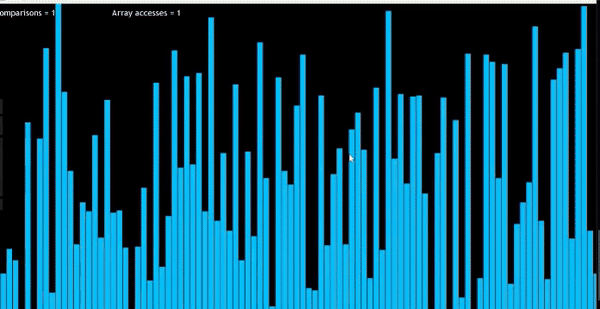

# Sorting Algorithms Visualization

This project is a Java-based sorting algorithms visualizer that helps to understand how different sorting algorithms work in real-time. The application provides visualizations for Bubble Sort, Selection Sort, Insertion Sort, and Merge Sort.

## Features

* Visualizes multiple sorting algorithms:
  - Bubble Sort
  - Selection Sort
  - Insertion Sort
  - Merge Sort
* Interactive GUI using Java Swing
* Real-time visualization of the sorting process
* Customizable array size (1-700 elements)

## How to Run

1. Ensure you have Java Development Kit (JDK) installed on your system.
2. Clone this repository: ```git clone https://github.com/Iammukundbajpai/Sorting-Algorithms-Visualization.git```
3. Navigate to the project directory: ```cd SortingAlgorithmVisualizer```
4. Compile the Java files: ```dir /s /B *.java > sources.txt & javac -d . @sources.txt```
5. Run the Visualiser class: ```java frames.Visualiser```

# Samples

- Sample (Merge Sort)


## Usage

1. When you run the program, you'll see a window with four buttons, each representing a different sorting algorithm.
2. You'll be prompted to enter the number of array elements (1-700). If you don't specify, it defaults to 270.
3. Click on any of the algorithm buttons to start the visualization for that particular sorting method.
4. A new window will open showing the sorting process in real-time.
5. Close the sorting window to return to the main menu and choose another algorithm.

## Project Structure

- `frames` package:
- `Visualiser.java`: Main class that sets up the GUI and handles user interactions
- `sorting` package (contains sorting algorithm implementations):
- `BubbleSort.java`
- `SelectionSort.java`
- `InsertionSort.java`
- `MergeSort.java`
- `Sorting.java`: Likely contains utility methods for sorting operations

## Author

Mukund Bajpai (mknd.bajpai@gmail.com)
